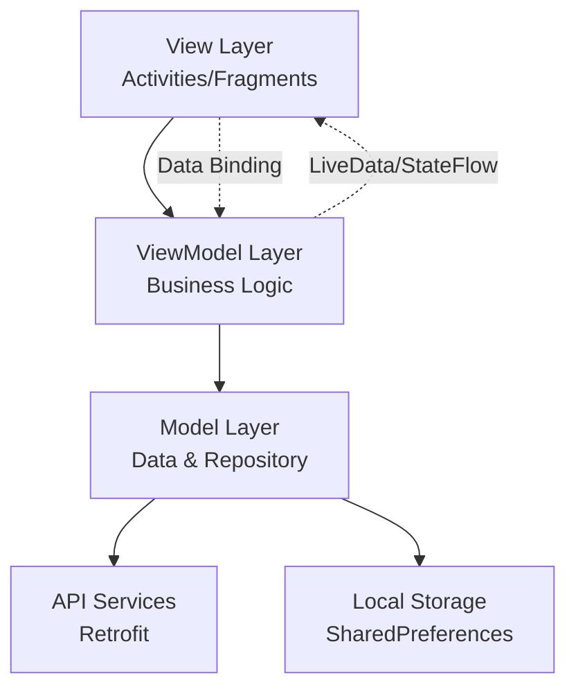
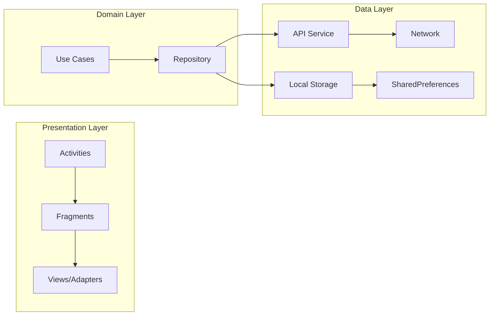
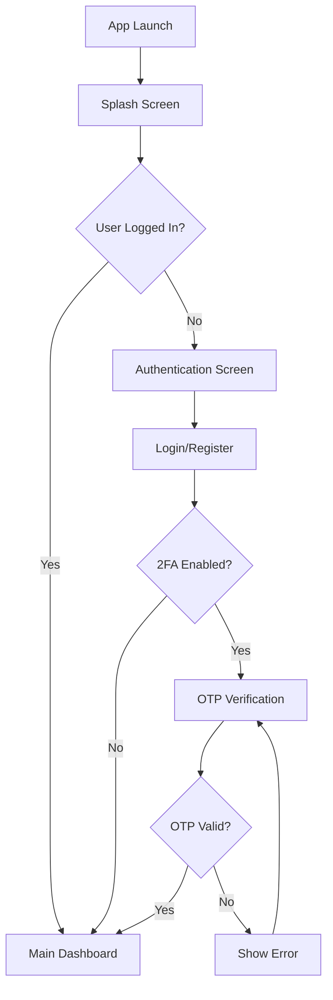
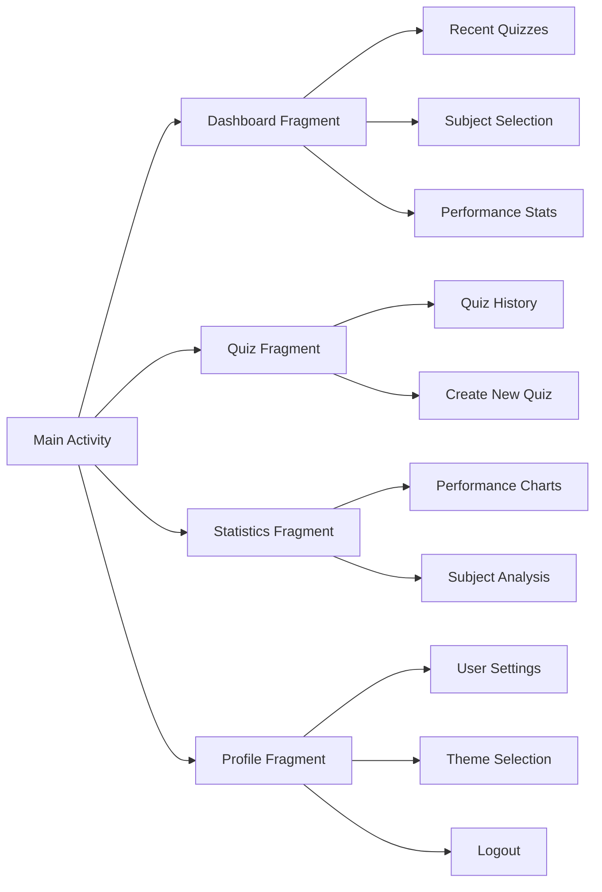

# 🎓 AI Exam Practice - Frontend (Android)

> **Advanced AI-Powered Exam Practice Application for Android**

[](https://developer.android.com)
[](https://kotlinlang.org)
[](LICENSE)
[]()

## 📋 Table of Contents

- [Overview](#-overview)
- [Features](#-features)
- [Architecture](#-architecture)
- [Technology Stack](#-technology-stack)
- [Project Structure](#-project-structure)
- [Application Flow](#-application-flow)
- [Installation & Setup](#-installation--setup)
- [API Integration](#-api-integration)
- [UI/UX Components](#-uiux-components)
- [Database & Storage](#-database--storage)
- [Testing Strategy](#-testing-strategy)
- [Performance Optimization](#-performance-optimization)
- [Security Implementation](#-security-implementation)
- [Contributing](#-contributing)
- [License](#-license)

## 🌟 Overview

**AI Exam Practice** is a sophisticated Android application designed to revolutionize the way students prepare for examinations. Leveraging artificial intelligence, the app generates dynamic, personalized quiz questions across multiple subjects, providing real-time analytics, performance tracking, and adaptive learning experiences.

### 🎯 Key Objectives
- **Personalized Learning**: AI-driven question generation based on user performance
- **Comprehensive Analytics**: Detailed performance insights and progress tracking
- **Multi-Subject Support**: Wide range of academic subjects and topics
- **Adaptive Difficulty**: Dynamic difficulty adjustment based on user performance
- **Real-time Assessment**: Instant feedback and detailed explanations

## ✨ Features

### 🔐 Authentication System
- **Email/Password Login**: Secure user authentication
- **Two-Factor Authentication (2FA)**: Enhanced security with OTP verification
- **Session Management**: Secure token-based authentication
- **Auto-login**: Persistent session management

### 📊 Dashboard & Analytics
- **Performance Overview**: Comprehensive statistics and metrics
- **Subject-wise Analysis**: Detailed breakdown by subjects
- **Progress Tracking**: Visual progress indicators and trends
- **Recent Quiz History**: Quick access to past quiz attempts
- **Achievement Badges**: Gamification elements

### 🎯 Quiz System
- **AI-Generated Questions**: Dynamic question generation using AI
- **Multiple Question Types**: MCQ, True/False, and Text-based questions
- **Difficulty Levels**: Easy, Medium, and Hard difficulty options
- **Time Management**: Dual timer system (exam + question level)
- **Custom Quiz Configuration**: Personalized quiz settings

### 📈 Analysis & Reporting
- **Detailed Quiz Analysis**: Question-by-question breakdown
- **Performance Charts**: Visual representation using MPAndroidChart
- **Strengths & Weaknesses**: Identify areas for improvement
- **Time Analysis**: Time spent per question and overall efficiency
- **Comparative Analysis**: Performance comparison across subjects

### 🎨 UI/UX Features
- **Material Design 3**: Modern, intuitive interface
- **Dark/Light Theme**: Customizable theme options
- **Responsive Layout**: Optimized for various screen sizes
- **Smooth Animations**: Enhanced user experience
- **Accessibility Support**: Inclusive design principles

## 🏗️ Architecture

### MVVM Architecture Pattern



### Application Architecture



## 💻 Technology Stack

### 🔧 Core Technologies
| Technology | Version | Purpose |
|------------|---------|---------|
| **Kotlin** | 1.9.22 | Primary programming language |
| **Android Gradle Plugin** | 8.13.0 | Build automation |
| **Min SDK** | 24 | Minimum Android version support |
| **Target SDK** | 34 | Target Android version |

### 📚 Key Dependencies

#### UI & Navigation
```kotlin
// Material Design & UI Components
implementation("com.google.android.material:material:1.9.0")
implementation("androidx.constraintlayout:constraintlayout:2.1.4")
implementation("androidx.coordinatorlayout:coordinatorlayout:1.2.0")

// Navigation Components
implementation("androidx.navigation:navigation-fragment-ktx:2.7.6")
implementation("androidx.navigation:navigation-ui-ktx:2.7.6")
```

#### Architecture Components
```kotlin
// Lifecycle & ViewModel
implementation("androidx.lifecycle:lifecycle-viewmodel-ktx:2.7.0")
implementation("androidx.lifecycle:lifecycle-livedata-ktx:2.7.0")

// Core Android
implementation("androidx.core:core-ktx:1.10.1")
implementation("androidx.appcompat:appcompat:1.6.1")
```

#### Networking & Data
```kotlin
// Retrofit for API calls
implementation("com.squareup.retrofit2:retrofit:2.9.0")
implementation("com.squareup.retrofit2:converter-gson:2.9.0")
implementation("com.squareup.okhttp3:logging-interceptor:4.12.0")

// Coroutines for async operations
implementation("org.jetbrains.kotlinx:kotlinx-coroutines-android:1.7.3")
```

#### Additional Libraries
```kotlin
// Image Loading
implementation("com.github.bumptech.glide:glide:4.16.0")

// Charts & Visualization
implementation("com.github.PhilJay:MPAndroidChart:v3.1.0")

// Preferences
implementation("androidx.preference:preference-ktx:1.2.1")
```

## 📁 Project Structure

```
app/
├── src/main/
│   ├── java/com/example/exampratice/
│   │   ├── 📱 Activities/
│   │   │   ├── SplashActivity.kt           # App launcher & routing
│   │   │   ├── AuthActivity.kt             # Authentication container
│   │   │   ├── MainActivity.kt             # Main app container
│   │   │   ├── QuizConfigurationActivity.kt # Quiz setup
│   │   │   ├── QuizActivity.kt             # Quiz execution
│   │   │   └── QuizAnalysisActivity.kt     # Results analysis
│   │   │
│   │   ├── 🧩 fragments/
│   │   │   ├── DashboardFragment.kt        # Home dashboard
│   │   │   ├── QuizFragment.kt             # Quiz management
│   │   │   ├── StatisticsFragment.kt       # Performance stats
│   │   │   └── ProfileFragment.kt          # User profile
│   │   │
│   │   ├── 🔐 auth/
│   │   │   ├── LoginFragment.kt            # User login
│   │   │   └── RegisterFragment.kt         # User registration
│   │   │
│   │   ├── 🔗 api/
│   │   │   ├── ApiClient.kt                # API configuration
│   │   │   ├── AuthService.kt              # Authentication APIs
│   │   │   └── QuizService.kt              # Quiz-related APIs
│   │   │
│   │   ├── 📊 models/
│   │   │   └── Models.kt                   # Data classes & DTOs
│   │   │
│   │   ├── 🎯 adapters/
│   │   │   ├── QuestionAdapter.kt          # Quiz questions
│   │   │   ├── SubjectAdapter.kt           # Subject selection
│   │   │   ├── RecentQuizAdapter.kt        # Quiz history
│   │   │   └── QuestionAnalysisAdapter.kt  # Analysis results
│   │   │
│   │   └── 🛠️ utils/
│   │       ├── PreferenceManager.kt        # Data persistence
│   │       └── ThemeManager.kt             # UI theme management
│   │
│   ├── 📱 res/
│   │   ├── layout/                         # XML layouts
│   │   ├── values/                         # Strings, colors, styles
│   │   ├── drawable/                       # Graphics & icons
│   │   └── mipmap/                         # App icons
│   │
│   └── AndroidManifest.xml                 # App configuration
│
├── 🏗️ build.gradle.kts                     # App-level build config
├── 📝 proguard-rules.pro                   # Code obfuscation rules
└── 🧪 build/                               # Generated build files
```

## 🔄 Application Flow

### 1. Authentication Flow



### 2. Quiz Generation & Execution Flow

```mzemaid
flowchart TD
    A[Dashboard] --> B[Select Subject]
    B --> C[Quiz Configuration]
    C --> D[Set Parameters]
    D --> E{Validate Input?}
    E -->|No| F[Show Validation Error]
    F --> D
    E -->|Yes| G[Generate Questions via AI API]
    G --> H{Questions Generated?}
    H -->|No| I[Show Error]
    H -->|Yes| J[Start Quiz]
    J --> K[Display Question]
    K --> L[User Answers]
    L --> M{More Questions?}
    M -->|Yes| N[Next Question]
    N --> K
    M -->|No| O[Submit Quiz]
    O --> P[Show Results]
    P --> Q[Analysis & Insights]
```

### 3. Main Navigation Flow



## 🚀 Installation & Setup

### Prerequisites
- **Android Studio**: Arctic Fox or later
- **JDK**: 11 or higher
- **Android SDK**: API level 24+
- **Gradle**: 7.0+

### Step-by-Step Installation

1. **Clone the Repository**
   ```bash
   git clone https://github.com/Suraj0834/AI_ExamPracticeFE.git
   cd AI_ExamPracticeFE
   ```

2. **Open in Android Studio**
   - Launch Android Studio
   - Select "Open an Existing Project"
   - Navigate to the cloned directory

3. **Configure Environment**
   ```kotlin
   // In local.properties file
   sdk.dir=/path/to/your/Android/Sdk
   ```

4. **Sync Dependencies**
   - Android Studio will automatically sync Gradle dependencies
   - If not, click "Sync Project with Gradle Files"

5. **API Configuration**
   ```kotlin
   // Update API base URL in ApiClient.kt
   private const val BASE_URL = "https://your-backend-api.com/api/"
   ```

6. **Build & Run**
   ```bash
   ./gradlew assembleDebug
   # OR use Android Studio's Run button
   ```

### 🔧 Build Configuration

```kotlin
android {
    namespace = "com.example.exampratice"
    compileSdk = 34

    defaultConfig {
        applicationId = "com.example.exampratice"
        minSdk = 24
        targetSdk = 34
        versionCode = 1
        versionName = "1.0"
    }

    buildFeatures {
        viewBinding = true
        dataBinding = false
    }

    buildTypes {
        release {
            isMinifyEnabled = true
            proguardFiles(
                getDefaultProguardFile("proguard-android-optimize.txt"),
                "proguard-rules.pro"
            )
        }
    }
}
```

## 🌐 API Integration

### Authentication Endpoints

| Method | Endpoint | Description |
|--------|----------|-------------|
| POST | `/auth/login` | User login with email/password |
| POST | `/auth/register` | New user registration |
| POST | `/auth/verify-otp` | Two-factor authentication |
| POST | `/auth/refresh` | Token refresh |

### Quiz Management Endpoints

| Method | Endpoint | Description |
|--------|----------|-------------|
| POST | `/generate/questions` | AI-powered question generation |
| POST | `/quiz/submit` | Submit quiz answers |
| GET | `/quiz/recent` | Fetch recent quiz history |
| GET | `/quiz/analysis/{id}` | Detailed quiz analysis |
| GET | `/quiz/subjects` | Available subjects list |
| GET | `/quiz/dashboard-stats` | Dashboard statistics |

### API Request/Response Examples

#### Generate Questions Request
```kotlin
data class GenerateQuestionsRequest(
    val subject: String,
    val topic: String? = null,
    val count: Int = 10,
    val timePerQuestion: Int = 60,
    val difficulty: String = "medium"
)
```

#### Quiz Submission Request
```kotlin
data class QuizSubmission(
    val subject: String,
    val answers: List<String>,
    val timeSpent: Int
)
```

## 🎨 UI/UX Components

### Material Design Implementation

#### Color Scheme
```xml
<!-- Primary Colors -->
<color name="primary">#6366F1</color>
<color name="primary_variant">#3730A3</color>
<color name="secondary">#EC4899</color>

<!-- Status Colors -->
<color name="success">#10B981</color>
<color name="warning">#F59E0B</color>
<color name="error">#EF4444</color>

<!-- Background Colors -->
<color name="background_light">#FFFFFF</color>
<color name="background_dark">#1F2937</color>
```

#### Typography
```xml
<!-- Text Styles -->
<style name="TextAppearance.Headline1">
    <item name="android:textSize">32sp</item>
    <item name="android:fontFamily">@font/roboto_bold</item>
</style>

<style name="TextAppearance.Body1">
    <item name="android:textSize">16sp</item>
    <item name="android:fontFamily">@font/roboto_regular</item>
</style>
```

### Custom Components

#### Quiz Timer Component
- **Dual Timer System**: Exam-level and question-level timers
- **Visual Indicators**: Color-coded time warnings
- **Auto-progression**: Automatic question advancement

#### Performance Charts
- **Progress Rings**: Circular progress indicators
- **Bar Charts**: Subject-wise performance comparison
- **Line Charts**: Performance trends over time

## 💾 Database & Storage

### SharedPreferences Implementation

```kotlin
class PreferenceManager(private val context: Context) {
    private val sharedPreferences = context.getSharedPreferences(
        "ExamPracticePrefs", 
        Context.MODE_PRIVATE
    )
    
    // Authentication
    fun saveAuthToken(token: String)
    fun getToken(): String?
    fun isLoggedIn(): Boolean
    
    // User Data
    fun saveUserProfile(name: String, email: String)
    fun getUserName(): String
    fun getUserEmail(): String
    
    // App Settings
    fun setDarkMode(enabled: Boolean)
    fun isDarkMode(): Boolean
}
```

### Data Models

#### Core Models
```kotlin
data class User(
    val id: String,
    val name: String,
    val email: String,
    val createdAt: String
)

data class Question(
    val question: String,
    val options: List<String>,
    val correctAnswer: String,
    val difficulty: String,
    val explanation: String?
)

data class QuizSession(
    val id: String,
    val subject: String,
    val totalQuestions: Int,
    val correctAnswers: Int,
    val score: Double,
    val duration: Int,
    val createdAt: String
)
```

## 🧪 Testing Strategy

### Unit Testing
- **JUnit 4**: Core business logic testing
- **Mockito**: Mocking external dependencies
- **Coroutines Testing**: Async operation testing

### UI Testing
- **Espresso**: UI interaction testing
- **Fragment Testing**: Isolated fragment testing
- **Navigation Testing**: Navigation flow validation

### Integration Testing
- **API Testing**: Network layer testing
- **Database Testing**: Data persistence testing
- **End-to-End Testing**: Complete user journey testing

### Test Structure
```kotlin
class QuizViewModelTest {
    @Test
    fun `generateQuestions should return questions on success`() {
        // Arrange
        val mockQuestions = listOf(/* mock data */)
        
        // Act
        viewModel.generateQuestions(subject, topic, count)
        
        // Assert
        assertEquals(mockQuestions, viewModel.questions.value)
    }
}
```

## ⚡ Performance Optimization

### Memory Management
- **ViewBinding**: Efficient view references
- **Lifecycle Awareness**: Proper lifecycle management
- **Image Optimization**: Glide for efficient image loading

### Network Optimization
- **Connection Pooling**: Efficient HTTP connections
- **Request Caching**: Reduce redundant API calls
- **Compression**: GZIP compression for responses

### UI Performance
- **RecyclerView Optimization**: ViewHolder pattern
- **Lazy Loading**: On-demand content loading
- **Animation Optimization**: Hardware-accelerated animations

## 🔒 Security Implementation

### Data Protection
- **Token-based Authentication**: JWT tokens
- **Secure Storage**: Encrypted SharedPreferences
- **Network Security**: HTTPS-only communication

### Input Validation
- **Client-side Validation**: Immediate user feedback
- **Server-side Validation**: Data integrity assurance
- **SQL Injection Prevention**: Parameterized queries

### Privacy Compliance
- **Data Minimization**: Collect only necessary data
- **User Consent**: Explicit permission for data usage
- **Right to Deletion**: User data removal capability

## 📊 Performance Metrics

### Key Performance Indicators (KPIs)
- **App Launch Time**: < 3 seconds
- **API Response Time**: < 2 seconds
- **Memory Usage**: < 100MB average
- **Battery Consumption**: Optimized background usage
- **Crash Rate**: < 0.1%

### Monitoring Tools
- **Firebase Crashlytics**: Crash reporting
- **Firebase Performance**: Performance monitoring
- **Android Vitals**: Play Console metrics

## 🔄 CI/CD Pipeline

### Automated Build Process
```yaml
name: Android Build
on: [push, pull_request]
jobs:
  build:
    runs-on: ubuntu-latest
    steps:
      - uses: actions/checkout@v2
      - name: Set up JDK 11
        uses: actions/setup-java@v2
        with:
          java-version: '11'
      - name: Build with Gradle
        run: ./gradlew assembleDebug
      - name: Run tests
        run: ./gradlew test
```

## 🤝 Contributing

### Development Workflow
1. **Fork the repository**
2. **Create a feature branch**: `git checkout -b feature/amazing-feature`
3. **Commit changes**: `git commit -m 'Add amazing feature'`
4. **Push to branch**: `git push origin feature/amazing-feature`
5. **Open a Pull Request**

### Code Style Guidelines
- **Kotlin Coding Conventions**: Follow official Kotlin style guide
- **Naming Conventions**: Use descriptive names for classes and methods
- **Documentation**: Comprehensive KDoc for public APIs
- **Testing**: Maintain 80%+ code coverage

### Pull Request Checklist
- [ ] Code follows style guidelines
- [ ] Self-review of code completed
- [ ] Tests added/updated for new features
- [ ] Documentation updated
- [ ] No breaking changes

## 📈 Roadmap

### Version 2.0 Features
- [ ] **Offline Mode**: Download questions for offline practice
- [ ] **Social Features**: Leaderboards and peer comparisons
- [ ] **Advanced Analytics**: ML-powered insights
- [ ] **Voice Questions**: Audio-based quiz questions
- [ ] **AR/VR Support**: Immersive learning experiences

### Version 2.1 Features
- [ ] **Multi-language Support**: Localization
- [ ] **Accessibility Improvements**: Enhanced accessibility features
- [ ] **Tablet Optimization**: Large screen support
- [ ] **Wear OS Support**: Smartwatch integration

## 📄 License

This project is licensed under the MIT License - see the [LICENSE](LICENSE) file for details.

## 👥 Team

### Development Team
- **Lead Developer**: [Suraj](https://github.com/Suraj0834)
- **UI/UX Designer**: Design Team
- **Backend Developer**: Backend Team
- **QA Engineer**: Quality Assurance Team

## 📞 Support

### Getting Help
- **Documentation**: Check this README and inline documentation
- **Issues**: [Create an issue](https://github.com/Suraj0834/AI_ExamPracticeFE/issues)
- **Discussions**: [Join discussions](https://github.com/Suraj0834/AI_ExamPracticeFE/discussions)

### Contact Information
- **Email**: suraj6202k@gmail.com

---

<div align="center">

**Built with ❤️ for Students Worldwide**

[]()
[]()
[]()

</div>
